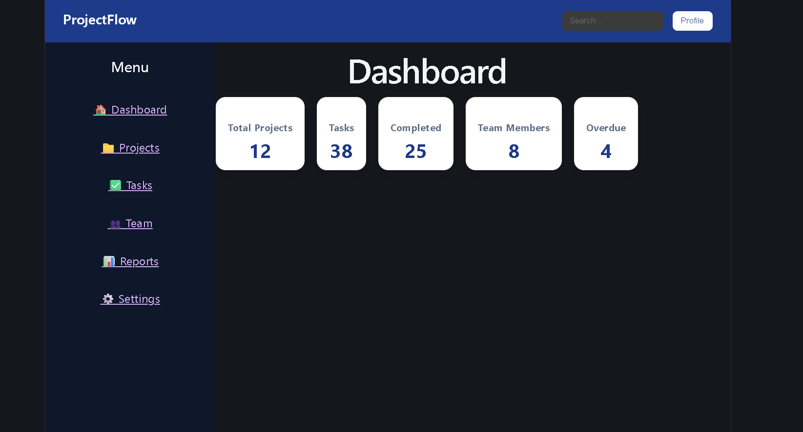

# Project Management App

A modern project management web application built with React and Vite.

The application allows users to create and manage projects through a clean, component-based user interface. This project was developed to strengthen my practical experience with React, component architecture, form handling, application state, and modern frontend development.

## Features
- Modern project management dashboard UI
- Dashboard summary cards for:
  - Total Projects
  - Tasks
  - Completed Tasks
  - Team Members
  - Overdue Tasks
- Sidebar navigation interface
- Top navigation bar with search and profile UI
- Reusable React components
- Component-based React architecture
- Responsive dashboard layout


## Tech Stack

- React
- Vite
- JavaScript
- HTML5
- CSS3
- Git
- GitHub

## Screenshots

### Dashboard



## Future Improvements

- Build the Projects management page
- Add project creation, editing, and deletion
- Build the Tasks management page
- Add task status and deadline tracking
- Build the Team management section
- Add Reports and analytics
- Implement Settings functionality
- Make search functional
- Add user authentication
- Connect the dashboard metrics to real project data
- Improve mobile responsiveness
- Deploy the application

### Clone the repository

```bash
git clone https://github.com/Devg-web/project-management-app.git